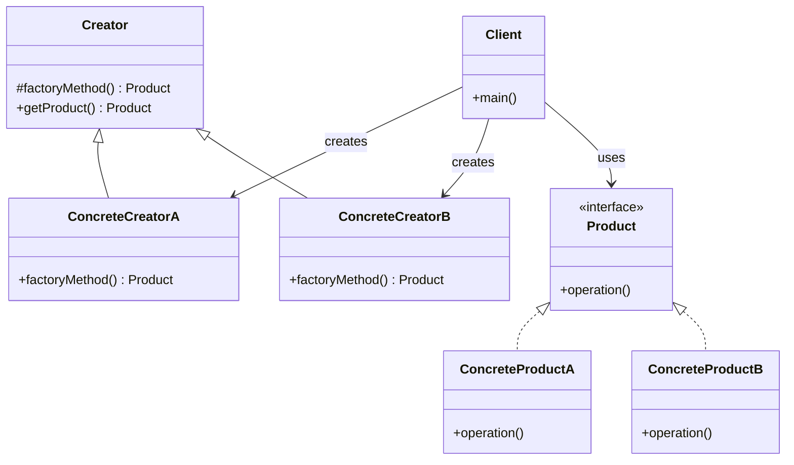

# First method-Strict Type

I] The First one is the -- "Strictest" implementation of the Pattern

   1. Creator class --> Abstract Class
   2. You create the subclass of Creator class for each product type which contains an implementation of the factory method
   3. To use factory method (create objects), you simply specify an instance of that type and invoke the factory

   PRODUCT:
    1. Product is the interface for the type of object that factory method creates

   CREATOR:
    1. Creator is the interface that defines the factory method
    2. Any other methods implemented here are written to operate on products produced by the factory method
    3. The creator class is written knowledge of the actual products that will be created

   Clients will need to subclass the creator class to make a particular concrete product
     * Only Subclass actually implement the factory method and create products
   
   The actual products that will be created is decided purely by the choice of the subclass that is used.
   
   DIS-ADVANTAGE:
    1. Every new product has to subclass the creator class and implement its factory method

# Class Diagram

## Explanation
| **Component**        | **Purpose**                                                              |
| -------------------- | ------------------------------------------------------------------------ |
| `Product`            | Interface or abstract class for product types                            |
| `ConcreteProductA/B` | Concrete implementations of the `Product` interface                      |
| `Creator`            | Abstract class declaring `factoryMethod()` and defining `getProduct()`   |
| `ConcreteCreatorA/B` | Subclasses implementing `factoryMethod()` to return a specific `Product` |
| `Client`             | Uses `Creator` to get a `Product`, unaware of the exact product class    |
