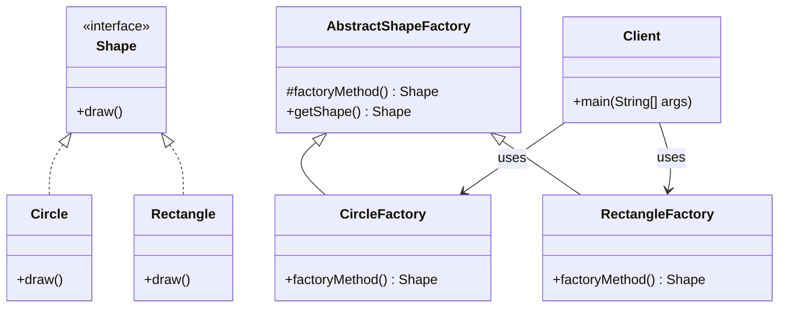

# First method-Strict Type

I] The First one is the -- "Strictest" implementation of the Pattern

   1. Creator class --> Abstract Class
   2. You create the subclass of Creator class for each product type which contains an implementation of the factory method
   3. To use factory method (create objects), you simply specify an instance of that type and invoke the factory

   PRODUCT:
    1. Product is the interface for the type of object that factory method creates

   CREATOR:
    1. Creator is the interface that defines the factory method
    2. Any other methods implemented here are written to operate on products produced by the factory method
    3. The creator class is written knowledge of the actual products that will be created

   Clients will need to subclass the creator class to make a particular concrete product
     * Only Subclass actually implement the factory method and create products
   
   The actual products that will be created is decided purely by the choice of the subclass that is used.
   
   DIS-ADVANTAGE:
    1. Every new product has to subclass the creator class and implement its factory method

# Class Diagram

## Explanation
Here’s a short description you can add along with the diagram:

This is a strict implementation of the Factory Method Design Pattern in Java. The pattern decouples the object creation logic from the client code using an abstract factory method.

Shape: Product interface declaring draw().

Circle, Rectangle: Concrete products implementing Shape.

AbstractShapeFactory: Creator class declaring the factory method factoryMethod().

CircleFactory, RectangleFactory: Concrete creators that override factoryMethod() to instantiate specific shapes.

Client: Uses the factories to create and use shapes without knowing their concrete classes.
   
